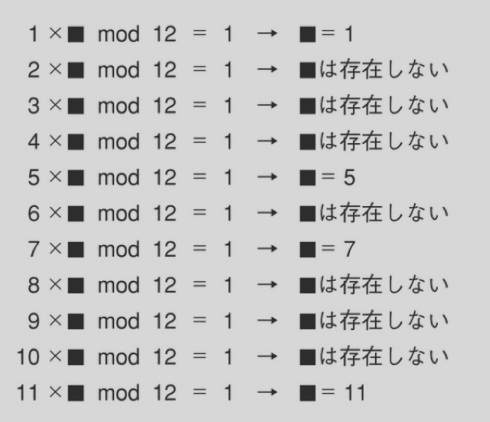
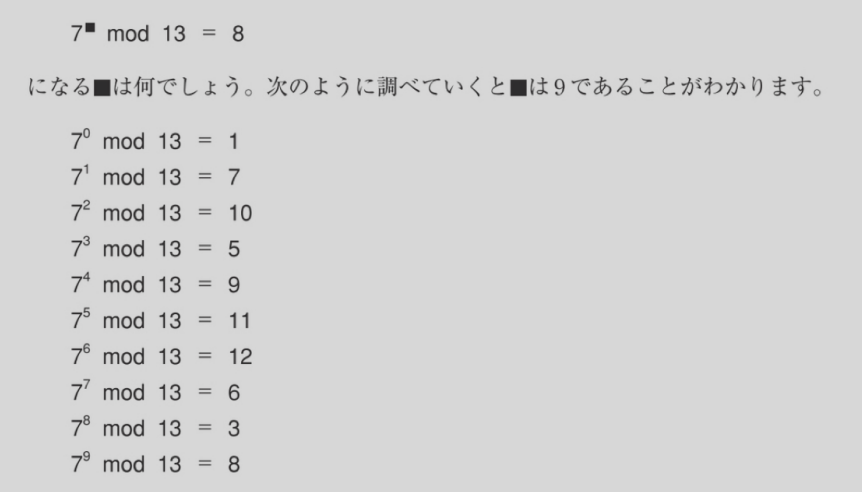
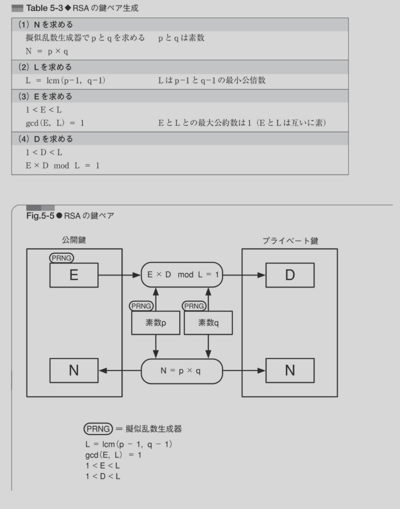

# 書くこと
- 4/26に発表する内容(群環体について)
-


## index
- 暗号とはなにか、なぜ数学を学ばなくてはいけないのか
- 共通鍵暗号と公開鍵暗号
- RSA暗号(素数、整数の性質がすごい！)
- 楕円暗号、上記より更にすごいあるごリズムが使われていてすごい！
- GCDやったよねって話
- 群環体について


## 方針
- 数学ガールから例をひっぱってくる(群環体)
- 抽象的 -> 具体的な例 -> コレでなにが嬉しいのかの流れでいけるとよい


## 1.暗号とはなにか、なぜ数学を学ばなくてはいけないのかう
数学理論は古代昔から一部マニアによって開発されていった


## 共通鍵暗号と公開鍵暗号
僕達がイメージしている暗号文
```
暗号文(ciphertext)
dibqmbc

平文(plaintext)
chaolab
```
↓

- シーザー暗号(本当は3文字のやつをいうらしい)　-> 共通鍵暗号
- 平文to暗号文の変換の仕方をアルゴリズムという。
- シーザ暗号は可能性が考うるすべての可能性を試すことができる。-> ブルート・フォース・アタック

---ここまでが僕が高校生くらいまでに思っていた暗号

現代
- コンピューターの発達により、幼稚なアルゴリズムは簡単に解かれるようになった
- 暗号を解く鍵を渡さなくてはいけないが、途中で盗まれるかもしれなく怖くて渡せない
- 現代では暗号のアルゴリズムはすべて公開されている
- え、じゃあ説かれるんじゃないの？？
- ここで素数(数学)の考えがでてくる

- 公開鍵 - 暗号化の鍵を持っているひとは誰でも暗号化できる。しかし、復号は復号化の鍵をもっている人だけ
- 送信者が必要なのは 暗号化 の鍵だけ
- 受信者が必要なのは 復号化　の鍵だけ
- 盗聴者にしられてこまるのは復号化の鍵
- 暗号化の鍵は盗聴者にしられてこまらない

- 使用の流れ
- ボブはキーペアをつくる
- public key をアリスに送る
- アリスはpublic key で暗号化し、おくる
- ボブはそれを復号化する


## modについて

7 * x = 1 (mod 12)
x = 7

これを言い換えると
1 / 7 は何ですか？という質問になる。整数では割れないのに不思議な世界。

mod の世界で逆数が存在するということは、公開鍵でのペアとなるものが存在するということにい行き着く!(すごい！)



離散来数



## RSA暗号(素数、整数の性質がすごい！)
RSAの名前は
RonRivest, AdiShamir, LeonardAdleman 3人の開発者の名前


```
# 暗号化
暗号文 = 平文^E mod N

EとNの組が公開鍵

# 復号化
平文 = 暗号文^D mod N
DとNの組が秘密鍵
```

RSAのアルゴリズム


めっちゃかんけつにいうと、RSAは素数&&modの性質を使っていることにより、解読には現代のコンピューターを使っても物理的に時間がたらないので不可能！ -> 素数すげ〜


## 楕円暗号、上記より更にすごいあるごリズムが使われていてすごい！
## GCDやったよねって話
## 群環体について

## 補足
## 1.
- アルファベット一文字ずつランダムにアルファベットを割り当てるアルゴリズムは単一換字
- これは鍵空間を大きくするばするほど、ブルートフォースアタックは困難になる
